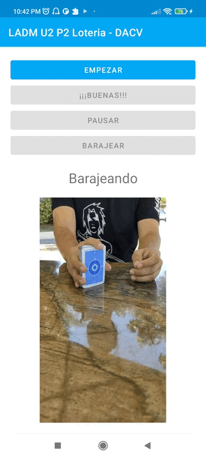

# LADM_U2_Practica1_CoposDeNieve

Daniel Alejandro Calderón Virgen
No Crtl 18401090
Ing en Sistemas Computacionales
Tecnológico Nacional de México, Campus Tepic

LABORATORIO DE APLICACIONES PARA DISPOSITIVOS MÓVILES
MTI SERGIO BENIGNO CASTILLO VALTIERRA

## Aplicación para lanzar cartas de la loteria mexicana

- Boton de **EMPEZAR** - Al hacer clic en él, se empiezan a lanzar las cartas
- Boton de **¡¡¡ BUENAS !!!** - Al hacer clic en él, se pausa el juego, y dando clic otra vez, se lanzan las cartas que no han salido
- Boton de **PAUSAR/REANUDAR**  - Al hacer clic en él se pausa o reanuda el juego
- Boton de **BARAJEAR** - Al hacer clic en él, se reinicia el juego
